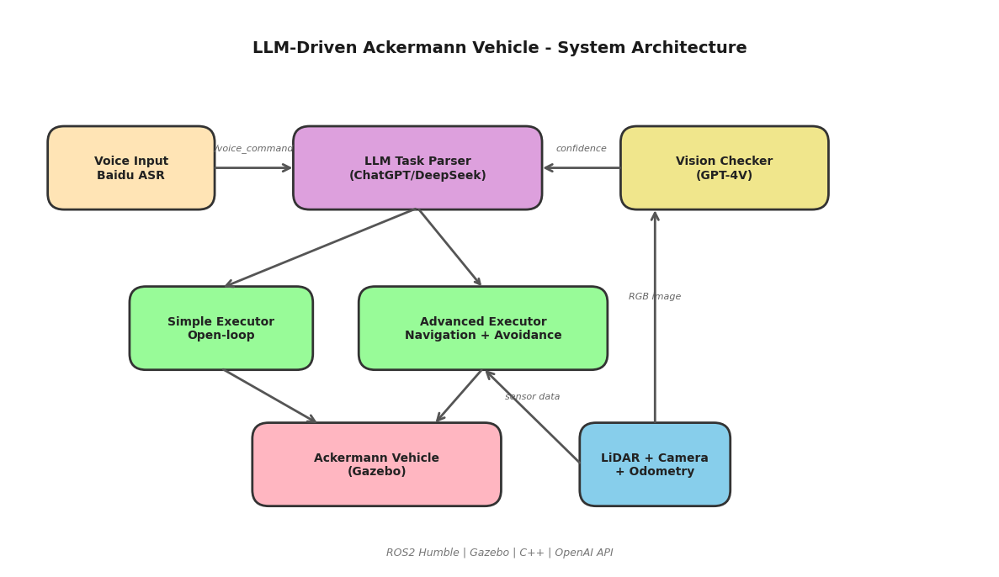
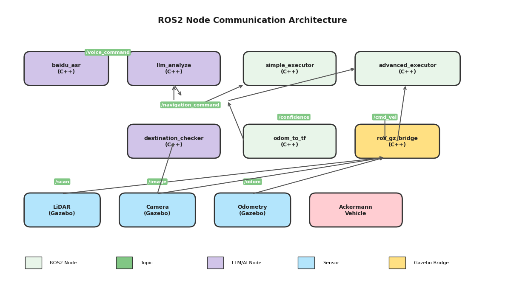
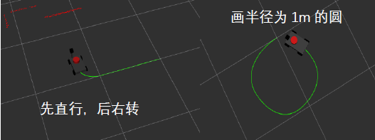

# 🤖 基于大模型的阿克曼结构智能车控制、导航与规划系统

> **北京理工大学 · 自动控制理论与实践课程设计**
>
> 基于 ROS2 + Gazebo + LLM 构建的智能车自然语言控制系统，支持语音/文本输入，实现从"说话"到"开车"的全链路自动化。

<p align="center">
  
</p>

---

## 📑 目录

- [项目亮点](#-项目亮点)
- [系统架构](#-系统架构)
- [环境要求](#-环境要求)
- [安装部署](#-安装部署)
- [快速启动](#-快速启动)
- [使用指南](#-使用指南)
- [项目结构](#-项目结构)
- [核心模块详解](#-核心模块详解)
- [配置说明](#-配置说明)
- [ROS2 话题接口](#-ros2-话题接口)
- [效果展示](#-效果展示)
- [常见问题](#-常见问题)
- [致谢与参考](#-致谢与参考)

---

## ✨ 项目亮点

| 特性 | 说明 |
|------|------|
| 🗣️ **自然语言控制** | 对机器人说中文即可操控——"去冰箱那里拿东西送到床边" |
| 🧠 **多级 LLM 决策** | 语音识别(百度ASR) → 任务规划(DeepSeek/GPT) → 视觉验证(GPT-4V) |
| 🚗 **阿克曼转向** | 真实汽车级前轮转向模型，非完整约束下的运动控制 |
| 🗺️ **语义导航** | 通过语义地图 + LLM 推理，将"去卧室"自动转换为坐标路径 |
| 🛡️ **实时避障** | 基于 360° LiDAR 的反应式避障 + 卡住检测 + 自动脱困 |
| 👁️ **视觉确认** | 到达目标后调用视觉大模型确认是否真正找到目标物体 |
| 🎙️ **语音输入** | 集成百度语音识别 API，支持麦克风实时语音指令 |
| 📐 **曲线绘制** | 支持 sin/cos/circle 等数学曲线轨迹绘制 |

---

## 🏗️ 系统架构

系统采用 **四层级联式智能体架构**：

```
┌─────────────────────────────────────────────────┐
│  Layer 1: 自然语言交互层                          │
│  ┌──────────────┐  ┌──────────────┐              │
│  │ 🎙️ 语音输入   │  │ ⌨️ 文本输入    │              │
│  │ (百度 ASR)   │  │ (终端输入)   │              │
│  └──────┬───────┘  └──────┬───────┘              │
│         └────────┬────────┘                      │
│                  ▼  /voice_command                │
├─────────────────────────────────────────────────┤
│  Layer 2: 智能决策层                              │
│  ┌──────────────────────────────────────┐        │
│  │ 🧠 LLM 任务解析 (DeepSeek / GPT)     │        │
│  │    自然语言 → 结构化 JSON 指令序列     │        │
│  └──────────────────┬───────────────────┘        │
│                     ▼  /navigation_command        │
├─────────────────────────────────────────────────┤
│  Layer 3: 运动控制层                              │
│  ┌──────────────┐  ┌───────────────────────┐     │
│  │ 简单执行器    │  │ 高级执行器              │     │
│  │ (开环控制)   │  │ (闭环导航+避障+脱困)  │     │
│  └──────┬───────┘  └──────────┬────────────┘     │
│         └────────┬────────────┘                  │
│                  ▼  /cmd_vel                      │
├─────────────────────────────────────────────────┤
│  Layer 4: 物理仿真层                              │
│  ┌──────────────────────────────────────┐        │
│  │ 🏠 Gazebo 仿真环境                    │        │
│  │    阿克曼小车 + LiDAR + Camera + Odom │        │
│  └──────────────────────────────────────┘        │
│         ▲ /odom  ▲ /scan  ▲ /camera              │
│         └────────┴────────┴── 反馈回路            │
└─────────────────────────────────────────────────┘
```

### ROS2 节点通信图

<p align="center">
  
</p>

---

## 💻 环境要求

| 组件 | 版本要求 |
|------|----------|
| **操作系统** | Ubuntu 22.04 LTS |
| **ROS2** | Humble Hawksbill |
| **Gazebo** | Gazebo Harmonic (gz-harmonic) |
| **编译器** | GCC 11+ (C++17) |
| **Python** | 3.10+ |
| **CMake** | 3.16+ |

### 系统依赖

```bash
# ROS2 核心
sudo apt install ros-humble-desktop

# Gazebo 相关
sudo apt install ros-humble-ros-gz-bridge ros-humble-ros-gz-sim

# 开发库
sudo apt install libcurl4-openssl-dev libjsoncpp-dev

# OpenCV (ROS2 自带，若缺失则手动安装)
sudo apt install libopencv-dev

# 语音输入 (可选，需要麦克风)
sudo apt install libasound2-dev

# 其他 ROS2 包
sudo apt install ros-humble-xacro \
                 ros-humble-robot-state-publisher \
                 ros-humble-joint-state-publisher \
                 ros-humble-joy
```

---

## 📦 安装部署

### 1. 克隆仓库

```bash
git clone https://github.com/windiff886/BIT-Control-Theory-Project.git
cd BIT-Control-Theory-Project
```

### 2. 编译工作空间

```bash
# Source ROS2 环境
source /opt/ros/humble/setup.bash

# 编译所有包
colcon build --symlink-install

# Source 工作空间
source install/setup.bash
```

> **提示**：首次编译可能需要 2-3 分钟。如遇到缺少依赖的错误，请根据报错信息使用 `sudo apt install` 安装对应的包。

### 3. 配置 API 密钥

编辑 LLM 参数配置文件：

```bash
nano src/api_invocation/config/llm_params.yaml
```

修改以下字段为你自己的 API 信息：

```yaml
/llm_analyzer:
  ros__parameters:
    api_key: "你的API密钥"                    # LLM API Key
    api_url: "https://api.deepseek.com/chat/completions"  # API 地址
    model: "deepseek-chat"                    # 模型名称

/advanced_executor:
  ros__parameters:
    vision_api_key: "你的视觉API密钥"         # 视觉模型 API Key  
    vision_api_url: "https://api.openai.com/v1/chat/completions"
    vision_model: "gpt-4o"                    # 需要支持图像输入的模型
```

**支持的 LLM 服务商**：DeepSeek、OpenAI (GPT)、智增增、百度文心 等所有兼容 OpenAI Chat Completions API 格式的服务。

如需使用语音输入，还需配置百度语音识别：

```bash
nano src/api_invocation/config/voice_asr_params.yaml
```

```yaml
/voice_input_asr_node:
  ros__parameters:
    baidu_api_key: "你的百度API Key"
    baidu_secret_key: "你的百度Secret Key"
```

> 百度语音识别 API 申请地址：https://console.bce.baidu.com/ai/#/ai/speech/app/list

### 4. 重新编译 (修改配置后)

```bash
colcon build --symlink-install --packages-select api_invocation
source install/setup.bash
```

---

## 🚀 快速启动

整个系统分为 **三步启动**，每步在独立的终端中运行。

### 终端 1：启动仿真环境

```bash
source install/setup.bash
ros2 launch br2_gazebo_worlds house_with_robot.launch.py 
```

这将启动：
- Gazebo 仿真器（加载 house.world 室内场景）
- 阿克曼结构车辆模型
- ROS2-Gazebo Bridge（话题桥接）
- RViz 可视化工具

> ⏳ 首次启动 Gazebo 需要下载模型资源，可能需要等待 1-2 分钟。

### 终端 2：启动 LLM 导航系统

```bash
source install/setup.bash
ros2 launch api_invocation llm_navigation.launch.py
```

这将启动：
- `model_state_publisher` — 发布场景物体位置信息给 LLM
- `llm_analyze` — LLM 自然语言解析节点
- `advanced_executor` — 高级导航执行器

### 终端 3：启动输入接口

**方式 A：文本输入（推荐，无需麦克风）**

```bash
source install/setup.bash
ros2 run api_invocation voice_input
```

**方式 B：语音输入（需要麦克风 + 百度ASR配置）**

```bash
source install/setup.bash
ros2 run api_invocation voice_input_asr --ros-args --params-file \
  install/api_invocation/share/api_invocation/config/voice_asr_params.yaml
```

### 开始使用！

在终端 3 输入自然语言指令，例如：

```
> 前进3秒
> 去冰箱那里
> 去卧室的床边
> 画一条sinx曲线
> 从客厅去厨房拿东西送到卧室
```

---

## 📖 使用指南

### 支持的指令类型

#### 1. 基础移动指令

```
"前进5秒"        → 直线前进
"左转90度"       → 阿克曼转向（自动配合前进速度）
"后退2秒"        → 直线后退
"向右前方行驶"    → 先右转再直行
"停"             → 紧急停止
```

LLM 会将上述指令解析为 `move_cmd` 类型的 JSON：
```json
[{"action": "move_cmd", "linear": 0.5, "angular": 0.0, "duration": 5.0}]
```

#### 2. 坐标导航

```
"去坐标(2,2)"           → 自主导航到 (2,2)
"走到茶几前面"           → 查语义地图，导航到茶几坐标
"去两个球中间"           → 计算中点坐标并导航
```

生成 `move_to` 指令，触发闭环导航控制：
```json
[{"action": "move_to", "x": 1.51, "y": -1.23}]
```

#### 3. 语义导航（带视觉确认）

```
"去冰箱那里"     → 导航 + 视觉确认是否看到冰箱
"去卧室"         → 经过门口绕行 + 确认到达卧室
"找到餐桌"       → 导航 + 目标物体视觉验证
```

生成带 `target` 字段的语义导航指令：
```json
[{"action": "move_to", "x": 8.70, "y": -1.03, "target": "refrigerator", "confidence": 0.80}]
```

#### 4. 复合任务

```
"去冰箱拿东西送到床边"
```

LLM 自动分解为多步骤序列，并规划穿门路径：
```json
[
  {"action": "move_to", "x": 8.70, "y": -1.03, "target": "refrigerator", "confidence": 0.80},
  {"action": "control_arm", "command": "lift"},
  {"action": "move_to", "x": -2.0, "y": -0.5},
  {"action": "move_to", "x": -6.16, "y": 2.03, "target": "bed", "confidence": 0.80},
  {"action": "control_arm", "command": "lower"}
]
```

#### 5. 特殊功能

```
"画一条sinx曲线"          → 正弦曲线轨迹
"画一个圆"               → 圆形轨迹
"等待3秒然后前进"          → wait + move_cmd 组合
"抬起机械臂"              → 机械臂控制
```

### 室内环境地图

仿真场景 `house.world` 包含以下区域和物体：

```
┌─────────────────────┬────────────────────────────────────┐
│                     │                                    │
│     🛏️ 卧室         │            🛋️ 客厅                  │
│                     │                                    │
│  床(-6.16, 2.03)    │     ⚽ 蓝色球(3.30, 4.22)          │
│  衣柜(-3.15, 2.48)  │                                    │
│  床头柜 x2          │     ⚽ 蓝色球(3.00, 0.00)          │
│                     │                                    │
│                  🚪门(-2.0, -0.5)                        │
│                     │     ☕ 茶几(1.51, -1.73)            │
│                     │                        🍳 厨房     │
│                     │                                    │
│                     │     🍽️ 餐桌(6.55, 0.95)            │
│                     │     🧊 冰箱(8.70, -1.03)           │
│                     │     🗄️ 橱柜(8.00, -3.84)           │
│                     │                                    │
└─────────────────────┴────────────────────────────────────┘
            车辆起始位置: 原点 (0, 0) ↑
```

> **重要**：房间之间有墙壁阻隔，LLM 会自动规划穿门路径（例如从客厅到卧室必须先经过门口 (-2.0, -0.5)）。

---

## 📂 项目结构

```
BIT-Control-Theory-Project/
├── src/
│   ├── api_invocation/                  # 🧠 核心功能包：LLM + 导航 + 执行
│   │   ├── src/
│   │   │   ├── llm_analyze.cpp          #   LLM 自然语言解析节点
│   │   │   ├── advanced_executor.cpp    #   高级执行器（闭环导航+避障+视觉确认）
│   │   │   ├── simple_executor.cpp      #   简单执行器（开环时间控制）
│   │   │   ├── model_state_publisher.cpp#   Gazebo 模型位置发布器
│   │   │   ├── voice_input.cpp          #   文本输入终端
│   │   │   ├── voice_input_asr.cpp      #   百度语音识别输入
│   │   │   ├── odom_to_tf.cpp           #   里程计→TF 坐标变换
│   │   │   ├── ground_truth_odom.cpp    #   Gazebo 真值里程计
│   │   │   ├── image_viewer.cpp         #   摄像头图像查看器
│   │   │   └── test_publisher.cpp       #   测试指令发布器
│   │   ├── config/
│   │   │   ├── llm_params.yaml          #   LLM API + 系统提示词配置
│   │   │   └── voice_asr_params.yaml    #   百度语音识别配置
│   │   ├── launch/
│   │   │   ├── gazebo_simulation.launch.py  # 仿真环境启动
│   │   │   └── llm_navigation.launch.py     # LLM 导航系统启动
│   │   ├── CMakeLists.txt
│   │   └── package.xml
│   │
│   ├── ackermann_v2/                    # 🚗 阿克曼车辆模型包
│   │   ├── model/
│   │   │   └── vehicle.xacro            #   车辆 URDF 模型（参数化）
│   │   ├── config/
│   │   │   ├── parameters.yaml          #   车辆物理参数
│   │   │   └── ros_gz_bridge.yaml       #   ROS2-Gazebo 话题桥接配置
│   │   ├── launch/
│   │   │   ├── vehicle.launch.py        #   车辆加载启动文件
│   │   │   └── joystick.launch.py       #   手柄控制启动文件
│   │   └── rviz/                        #   RViz 可视化配置
│   │
│   └── br2_gazebo_worlds/               # 🏠 Gazebo 仿真场景包
│       ├── worlds/
│       │   ├── house.world              #   室内家居场景（主场景）
│       │   ├── empty.world              #   空旷场景
│       │   └── ...                      #   其他测试场景
│       ├── models/                      #   3D 家具模型 + 纹理
│       └── launch/
│           └── house_with_robot.launch.py
│
├── docs/                                # 📄 文档与图片资源
├── report.tex                           # 📝 LaTeX 课程报告
├── report.docx                          # 📝 Word 课程报告
└── README.md                            # 📖 本文件
```

---

## 🔧 核心模块详解

### 1. LLM 任务解析 (`llm_analyze`)

**功能**：接收自然语言文本，调用 LLM API 生成结构化 JSON 指令序列。

**工作流程**：

```
用户输入 "去冰箱那里拿东西"
        ↓
  订阅 /voice_command 话题
        ↓
  注入动态环境信息 (模型位置 + 语义地图)
        ↓
  构建 System Prompt + User Message
        ↓
  HTTPS 调用 LLM API (libcurl)
        ↓
  解析 JSON 响应
        ↓
  发布到 /navigation_command 话题
        ↓
[{"action":"move_to","x":8.70,"y":-1.03,"target":"refrigerator","confidence":0.8},
 {"action":"control_arm","command":"lift"}]
```

**Prompt 工程要点**：
- 声明阿克曼物理约束（无法原地旋转）
- 嵌入室内语义地图（家具坐标 + 墙壁门口信息）
- 穿门路径规则（跨房间必须先导航到门口）
- 丰富的 Few-shot 示例引导输出格式

### 2. 高级执行器 (`advanced_executor`)

**功能**：执行 JSON 任务队列，集成闭环导航、避障、脱困和视觉确认。

**核心算法**：

| 功能 | 算法 | 说明 |
|------|------|------|
| 目标导航 | 比例控制 | 根据角度偏差 Δψ 计算角速度 ω，根据距离调整线速度 v |
| 实时避障 | 扇区比较法 | 前方 ±30° 检测障碍，比较左右 90° 扇区平均距离决定转向 |
| 卡住检测 | 时间-距离准则 | 避障超过 3s 且移动不足 0.5m 判定卡住 |
| 自动脱困 | 后退-转向 | 后退 1.5s → 大角度转向 1.5s → 恢复导航 |
| 视觉确认 | 多帧投票 | 连续 N 帧置信度 > θ 才确认到达 |

**导航控制公式**：

```
目标方位角:  α = atan2(y_goal - y_curr, x_goal - x_curr)
角度偏差:    Δψ = α - ψ_curr    (归一化到 [-π, π])
角速度:      ω = clamp(0.8 × Δψ, -0.8, +0.8)
线速度:      v = 0.3 (|Δψ|>0.5) 或 0.8 (|Δψ|≤0.5)
到达判定:    distance < 0.3m
```

### 3. 视觉目标确认 (`checkVisionTarget`)

**功能**：导航到达后，通过摄像头图像 + 视觉大模型确认目标物体。

```
到达目标坐标附近
    ↓
获取当前摄像头画面
    ↓
Base64 编码图像
    ↓
发送给 GPT-4V: "图中是否有冰箱？返回置信度(0-1)"
    ↓
接收置信度 0.93
    ↓
连续 3 帧置信度 > 0.7 → 确认到达 ✅
```

### 4. 模型状态发布器 (`model_state_publisher`)

**功能**：解析 Gazebo 场景文件，实时发布物体位置给 LLM，使其"看见"环境变化。

---

## ⚙️ 配置说明

### LLM 参数配置 (`llm_params.yaml`)

```yaml
/llm_analyzer:
  ros__parameters:
    api_key: "sk-xxx"                              # API 密钥
    api_url: "https://api.deepseek.com/chat/completions"  # API 端点
    model: "deepseek-chat"                         # 模型名称
    temperature: 0.1                               # 低温度 = 更确定性的输出
    system_prompt: "..."                           # 系统提示词（含语义地图）

/advanced_executor:
  ros__parameters:
    vision_api_key: "sk-xxx"                       # 视觉模型 API 密钥
    vision_api_url: "https://api.openai.com/v1/chat/completions"
    vision_model: "gpt-4o"                         # 视觉模型
```

### 车辆物理参数 (`parameters.yaml`)

```yaml
# 车体
body_length: 0.3          # 车身长度 [m]
body_width: 0.18          # 车身宽度 [m]
body_height: 0.05         # 车身高度 [m]

# 车轮
wheel_radius: 0.04        # 车轮半径 [m]
wheel_width: 0.02         # 车轮宽度 [m]

# 运动学
max_steering_angle: 0.61  # 最大转向角 [rad] ≈ 35°
max_velocity: 2.0         # 最大速度 [m/s]

# 摄像头
image_width: 640          # 图像宽度 [px]
image_height: 480         # 图像高度 [px]
camera_fov: 1.396         # 视场角 [rad] ≈ 80°
camera_fps: 30            # 帧率 [Hz]
```

### ROS2-Gazebo 话题桥接 (`ros_gz_bridge.yaml`)

| ROS2 话题 | Gazebo 话题 | 方向 |
|-----------|-------------|------|
| `/cmd_vel` | `/cmd_vel` | ROS → GZ |
| `/odom` | `/model/.../odometry_wheels` | GZ → ROS |
| `/scan` | `scan` | GZ → ROS |
| `/camera/image_raw` | `camera` | GZ → ROS |
| `/joint_states` | `joint_states` | GZ → ROS |
| `/tf` | `/tf` | GZ → ROS |

---

## 📡 ROS2 话题接口

| 话题 | 类型 | 发布者 | 订阅者 | 说明 |
|------|------|--------|--------|------|
| `/voice_command` | `std_msgs/String` | voice_input | llm_analyze | 用户文本指令 |
| `/navigation_command` | `std_msgs/String` | llm_analyze | advanced_executor | JSON 任务序列 |
| `/cmd_vel` | `geometry_msgs/Twist` | advanced_executor | Gazebo | 速度控制 |
| `/odom` | `nav_msgs/Odometry` | Gazebo | advanced_executor | 里程计位姿 |
| `/scan` | `sensor_msgs/LaserScan` | Gazebo | advanced_executor | 激光雷达 |
| `/camera/image_raw` | `sensor_msgs/Image` | Gazebo | advanced_executor | 摄像头图像 |
| `/gazebo/model_states` | `std_msgs/String` | model_state_pub | llm_analyze | 场景物体位置 |
| `/trajectory` | `nav_msgs/Path` | advanced_executor | RViz | 运动轨迹 |

---

## 🎬 效果展示

### 轨迹可视化

下图展示了智能车在仿真环境中执行导航任务时的运动轨迹：

<p align="center">
  
  <br/>
  <em>图：智能车导航轨迹可视化（Python matplotlib 绘制）</em>
</p>

### 典型使用场景演示

**场景 1：基础控制**
```
用户: "前进5秒然后左转90度"
LLM → [{"action":"move_cmd","linear":0.5,"angular":0.0,"duration":10.0},
        {"action":"move_cmd","linear":0.5,"angular":0.5,"duration":3.14}]
```

**场景 2：跨房间语义导航**
```
用户: "从客厅去卧室的床"
LLM → [{"action":"move_to","x":-2.0,"y":-0.5},           ← 先到门口
        {"action":"move_to","x":-6.16,"y":2.03,
         "target":"bed","confidence":0.80}]                ← 再到床边+视觉确认
```

**场景 3：复合任务**
```
用户: "去冰箱拿东西送到床边"
LLM → [{"action":"move_to","x":8.70,"y":-1.03,"target":"refrigerator",...},
        {"action":"control_arm","command":"lift"},          ← 拿起
        {"action":"move_to","x":-2.0,"y":-0.5},            ← 穿门
        {"action":"move_to","x":-6.16,"y":2.03,"target":"bed",...},
        {"action":"control_arm","command":"lower"}]         ← 放下
```

---

## ❓ 常见问题

<details>
<summary><b>Q: Gazebo 启动后黑屏或模型加载失败？</b></summary>

首次运行需要下载 Gazebo 模型资源，请确保网络畅通。也可以手动设置模型路径：
```bash
export GZ_SIM_RESOURCE_PATH=$GZ_SIM_RESOURCE_PATH:$(pwd)/src/br2_gazebo_worlds/models
```
</details>

<details>
<summary><b>Q: LLM API 调用超时？</b></summary>

1. 检查 API 密钥是否正确
2. 检查网络是否能访问 API 端点：`curl -I https://api.deepseek.com`
3. API 调用超时默认为 30 秒，可在代码中调整 `CURLOPT_TIMEOUT`
</details>

<details>
<summary><b>Q: 车辆在仿真中不动或抖动？</b></summary>

- 确认 `/cmd_vel` 话题有数据：`ros2 topic echo /cmd_vel`
- 确认 ROS-GZ Bridge 正常运行：`ros2 topic list` 应包含 `/odom`、`/scan` 等
- 检查 Gazebo 物理仿真是否暂停（按空格键切换）
</details>

<details>
<summary><b>Q: 语音输入报错 "cannot open audio device"？</b></summary>

1. 检查麦克风是否连接：`arecord -l`
2. 修改 `voice_asr_params.yaml` 中的 `audio_device` 为正确的设备名
3. 确保已安装 ALSA 开发库：`sudo apt install libasound2-dev`
</details>

<details>
<summary><b>Q: 如何切换 LLM 服务商？</b></summary>

只需修改 `llm_params.yaml` 中的三个字段：

| 服务商 | `api_url` | `model` |
|--------|-----------|---------|
| DeepSeek | `https://api.deepseek.com/chat/completions` | `deepseek-chat` |
| OpenAI | `https://api.openai.com/v1/chat/completions` | `gpt-4o` |
| 百度文心 | `https://aip.baidubce.com/...` | `ernie-4.0` |

所有兼容 OpenAI Chat Completions 格式的 API 均可直接使用。
</details>

<details>
<summary><b>Q: 如何只启动基础控制（不需要导航）？</b></summary>

使用简单执行器替代高级执行器：
```bash
ros2 run api_invocation simple_executor
```
</details>

---

## 🙏 致谢与参考

本项目在以下开源项目和研究工作的基础上构建：

- [ROS2 Humble](https://docs.ros.org/en/humble/) — 机器人操作系统
- [Gazebo Harmonic](https://gazebosim.org/) — 物理仿真引擎
- [DeepSeek](https://www.deepseek.com/) / [OpenAI GPT](https://openai.com/) — 大语言模型
- [百度智能云 ASR](https://ai.baidu.com/tech/speech/asr) — 语音识别
- [CoNVOI](https://arxiv.org/abs/2310.12283) — 认知地图导航方法参考
- [OpenSeeD](https://github.com/IDEA-Research/OpenSeeD) — 开放词汇视觉感知

---

<p align="center">
  <b>北京理工大学 · 自动化学院 · 自动控制理论与实践课程设计</b>
  <br/>
  Made with ❤️ and 🤖
</p>
